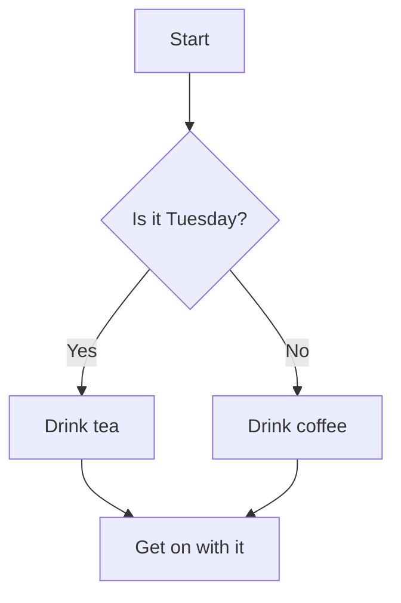
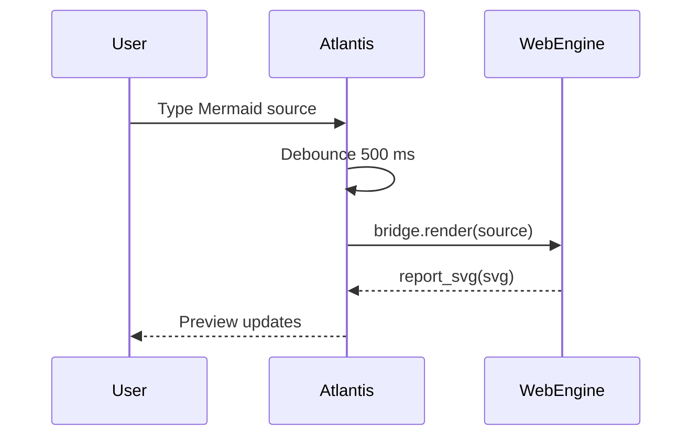
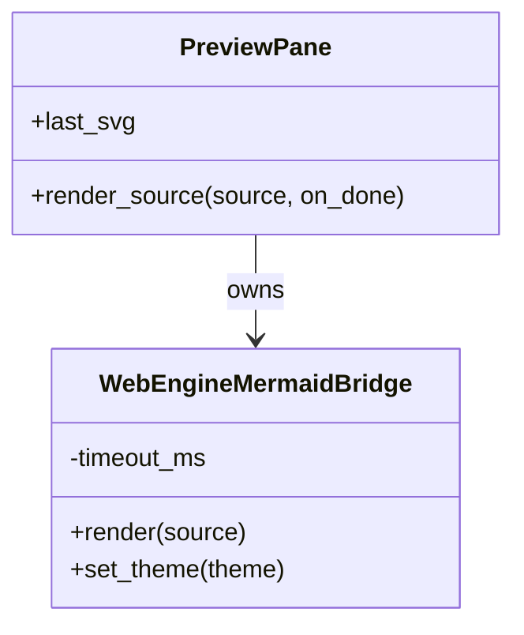

# Examples gallery

A small set of Mermaid sources to paste into the Atlantis editor. The diagrams below render in the live preview — this docs site shows them as code blocks for reference.

## Flowchart

## Sequence diagram

## Class diagram

These three diagram families (`flowchart`, `sequenceDiagram`, `classDiagram`) exercise the main code paths in the WebEngine bridge. If you can render all three locally, the bridge is healthy.
