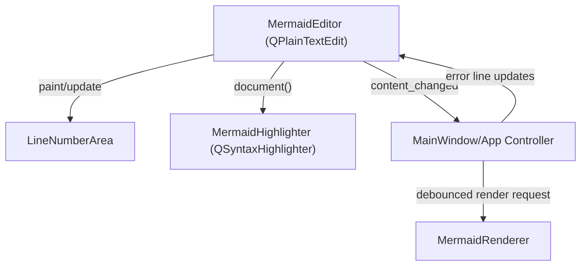

# Creative Phase: Editor Component

## Status
Complete

## Type
UI/UX and architecture

## Problem Statement
Atlantis needs a Mermaid source editor that supports line numbers, syntax highlighting, inline error feedback, soft wrap, session-scoped undo/redo, and a native desktop feel. The editor must be reliable for the MVP while leaving a path to richer editing later.

## Requirements
- Mermaid source remains the primary editing surface.
- Editor must support line numbers, soft wrap, standardized indentation, and undo/redo.
- Editor should support Mermaid-specific syntax highlighting and inline error highlighting.
- MVP should remain maintainable in Python/PyQt6.
- Advanced editor features such as multi-cursor editing are out of scope for MVP.
- UI should follow native platform conventions and system theme.

## Options Analysis

### Option 1: QPlainTextEdit with Custom Line Number Gutter and QSyntaxHighlighter
Description: Build a native editor using `QPlainTextEdit`, a companion gutter widget for line numbers, and a custom `QSyntaxHighlighter` attached to the document.

Pros:
- Native PyQt6 widget with straightforward signal/slot integration.
- Low dependency and packaging risk.
- Fits MVP scope without bringing browser editor complexity into the editing surface.
- Easy to test with pytest-qt.
- Supports session undo/redo and extra selections for inline error highlighting.

Cons:
- Mermaid highlighting must be implemented manually and will start basic.
- No multi-cursor or language-server-level editing features.
- More custom work for polished gutter behavior.

Complexity: Medium
Implementation time: Low to medium
Technical fit: High

### Option 2: Embedded Monaco or CodeMirror in QWebEngineView
Description: Use a browser-based editor embedded in Qt WebEngine.

Pros:
- Rich editing features and mature syntax/theme ecosystem.
- Better long-term potential for editor extensions and sophisticated language modes.
- Web editor could align well with Mermaid preview technology.

Cons:
- Adds browser/editor bridge complexity before the MVP proves the core workflow.
- Harder packaging and offline bundling story.
- More difficult to test reliably from Python.
- Risks shifting effort from Mermaid GUI workflow to editor infrastructure.

Complexity: High
Implementation time: High
Technical fit: Medium for MVP, high for future

### Option 3: Third-Party Native Code Editor Widget
Description: Add a Python/Qt editor component such as QScintilla.

Pros:
- Mature editor features and line number support.
- Less custom editor infrastructure than QPlainTextEdit.

Cons:
- Additional dependency and packaging risk.
- Mermaid-specific language support may still require custom work.
- Could overfit the MVP to a less common dependency.

Complexity: Medium
Implementation time: Medium
Technical fit: Medium

## Decision
Choose **Option 1: QPlainTextEdit with custom gutter and QSyntaxHighlighter** for the MVP.

## Rationale
This option best matches the project brief: code-first, native-feeling, single-chart, and scoped to reliable MVP delivery. PyQt6 documentation confirms the core pattern: attach a custom `QSyntaxHighlighter` to the editor document and implement highlighting in `highlightBlock()`. Inline errors can use `QPlainTextEdit.ExtraSelection`, and line numbers can be handled by a narrow child widget or side panel.

Richer browser-based editing remains a post-MVP option once the core file/render/recovery loop is proven.

## Implementation Guidelines
- Create `atlantis/ui/editor.py` with:
  - `MermaidEditor(QPlainTextEdit)`
  - `LineNumberArea(QWidget)`
  - `MermaidHighlighter(QSyntaxHighlighter)`
- Keep syntax highlighting lightweight:
  - diagram declarations (`graph`, `flowchart`, `sequenceDiagram`, etc.)
  - arrows/connectors
  - comments
  - front matter fence markers
- Configure:
  - soft wrap enabled by default
  - fixed-width font using system monospace defaults
  - four-space indentation
  - native palette colors from current theme
- Emit high-level signals:
  - `content_changed(str)`
  - `cursor_line_changed(int)`
  - `render_requested(str)` after debounce is coordinated by controller/app layer
- Provide methods:
  - `set_error_lines(lines: list[int])`
  - `clear_error_highlights()`
  - `set_wrap_enabled(enabled: bool)`
- Do not embed Mermaid rendering logic in the editor component.

## Validation
- Requirement coverage:
  - Native code-first editor: yes
  - Line numbers: yes
  - Syntax highlighting: yes, basic MVP
  - Inline errors: yes
  - Low packaging risk: yes
  - Future editor upgrade path: yes
- Testing approach:
  - Unit-test highlighter token rules where practical.
  - pytest-qt smoke tests for typing, line number area resize, and error selections.
- Quality score: 47/50

## Architecture Sketch

## Next Steps
- Implement this in Phase 1/2 of BUILD.
- Revisit Monaco/CodeMirror only after MVP editor, preview, file, and recovery flows are stable.
