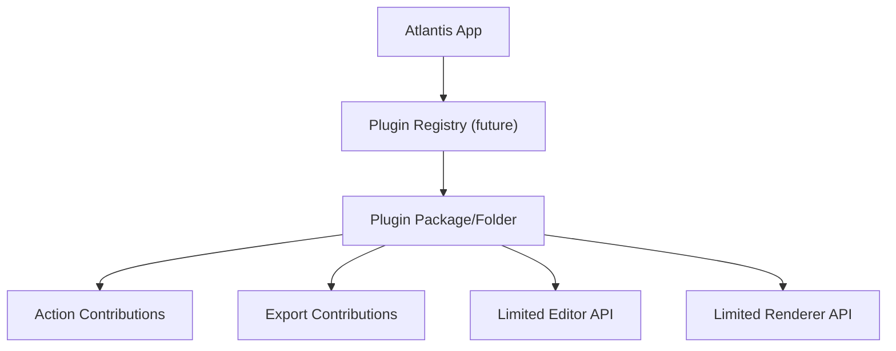

# Creative Phase: Packaging and Plugin Boundaries

## Status
Complete

## Type
Architecture design

## Problem Statement
Atlantis needs an MVP structure that can eventually become a portable offline desktop app and support plugins, without allowing those future goals to distort the MVP. Packaging and plugin decisions should shape boundaries now, but implementation should stay minimal.

## Requirements
- MVP: local Python execution is acceptable.
- Long-term: portable packaged desktop app across macOS, Windows, and Linux.
- Final product must bundle Mermaid.js locally for offline operation.
- Plugins are out of scope for MVP.
- Plugins must not alter Mermaid syntax or output format.
- Future plugins should be local-only, filesystem-based, sandboxed, and globally configured.
- Build system should remain Python packaging friendly.

## Options Analysis

### Option 1: MVP Runs from Python Package; Defer App Bundling
Description: Build a clean Python package with console/GUI entry point and asset-loading abstractions. Do not choose PyInstaller/Briefcase/cx_Freeze until the app core stabilizes.

Pros:
- Keeps MVP focused on core editor/preview/file reliability.
- Avoids premature packaging tool lock-in.
- Lets tests and CI run normally from editable installs.
- Asset-loading abstractions can be built once and reused by future packagers.

Cons:
- No native `.app`/installer in the first BUILD milestones.
- Packaging risk remains unresolved until later validation.

Complexity: Low
Implementation time: Low
Technical fit: High for MVP

### Option 2: Commit Early to PyInstaller
Description: Use PyInstaller from the start and design assets around its runtime layout.

Pros:
- Early visibility into bundle size and platform issues.
- Common path for PyQt desktop apps.
- Useful for macOS `.app` prototype.

Cons:
- Tool-specific layout may leak into code.
- Adds CI complexity early.
- Distracts from the MVP workflow.

Complexity: Medium
Implementation time: Medium
Technical fit: Medium

### Option 3: Commit Early to Briefcase
Description: Use BeeWare Briefcase early for native app packaging.

Pros:
- Native packaging model.
- Potentially good long-term desktop distribution story.

Cons:
- Extra project conventions and setup before core app exists.
- WebEngine support and PyQt packaging must be proven separately.
- More uncertainty than MVP can absorb.

Complexity: High
Implementation time: High
Technical fit: Low to medium

## Decision
Choose **Option 1: MVP runs from the Python package; defer app bundling**, while designing assets and plugin boundaries so packaging remains straightforward later.

## Rationale
The MVP must prove Atlantis' primary workflow: create, edit, preview, validate, autosave, recover, and save a single Mermaid chart. Packaging is important, but it should not dictate the first architecture. A clean package with explicit asset lookup, entry points, and no global side effects gives future packagers a stable target.

## Packaging Guidelines
- Add a `atlantis/assets/` package for HTML templates, Mermaid bundle, icons, and CSS.
- Use `importlib.resources.files("atlantis.assets")` for asset paths where possible.
- Avoid hard-coded relative paths from current working directory.
- Keep all app startup in `atlantis/main.py` and pure setup in `atlantis/core/app.py`.
- Add packaging validation later:
  - Phase 5: build wheel/sdist and run import smoke test.
  - Post-MVP: evaluate PyInstaller first for macOS `.app`.
  - Later: compare Briefcase/cx_Freeze if PyInstaller is a poor fit.

## Plugin Boundary Decision
Implement **no plugin host in MVP**, but reserve explicit extension boundaries:
- `renderer` facade: future export/render extensions can integrate without changing editor.
- `frontmatter` parser module: future schema helpers can live behind this boundary.
- `ui` menu/action registry: future plugins can add actions through a controlled registry.

Do not add dynamic plugin loading during MVP.

## Future Plugin Guardrails
- Local filesystem only.
- Globally configured, not per `.mmd` file in MVP/Post-MVP early stages.
- Cannot modify Mermaid syntax or write non-standard Mermaid output.
- Cannot execute network calls by default.
- Runs through a constrained API surface, not arbitrary imports into app internals.
- Must be disable-able from settings.

## Proposed Future Shape

## Implementation Guidelines for BUILD
- Keep module APIs small and explicit.
- Avoid global singleton state except a thin settings/logging service.
- Use Qt signals or simple callbacks between subsystems.
- Do not design plugin config UI in MVP.
- Document plugin scope as future in MkDocs and Memory Bank only.

## Validation
- Requirement coverage:
  - MVP local Python execution: yes
  - Future portable app path: yes
  - Offline asset path: yes
  - Plugin guardrails: yes
  - MVP scope protected: yes
- Testing approach:
  - Unit-test asset lookup once assets exist.
  - CI wheel/sdist build after package structure exists.
  - Future packaging smoke test on macOS before beta.
- Quality score: 46/50

## Next Steps
- During BUILD, structure `atlantis/assets/` and `importlib.resources` from the start.
- Do not add plugin runtime yet.
- Add an ADR in docs later summarizing why packaging is deferred until the core app stabilizes.
