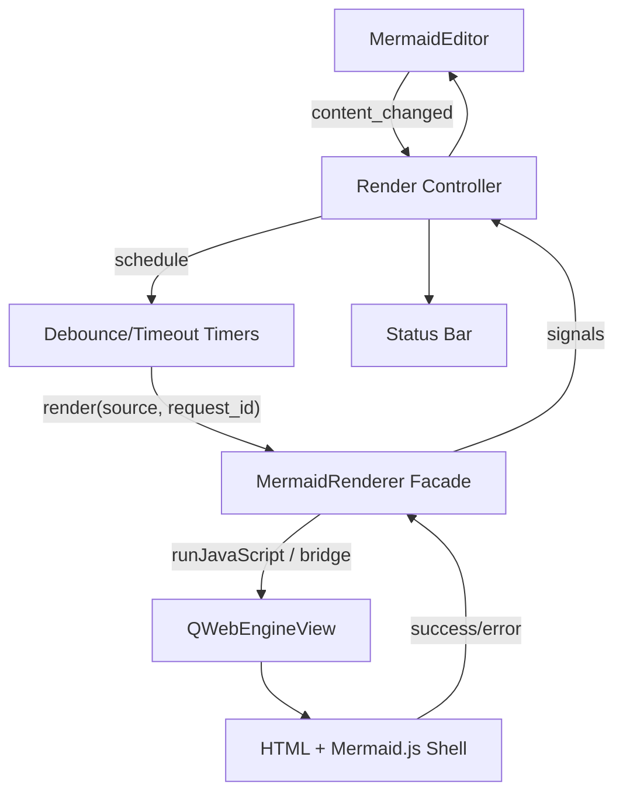

# Creative Phase: Renderer and Offline Bundle

## Status
Complete

## Type
Architecture design

## Problem Statement
Atlantis must render Mermaid diagrams inside a desktop app, preserve the last known good preview on errors, and eventually work offline. The MVP may use a CDN if required, but the architecture should avoid painting the project into a network-dependent corner.

## Requirements
- Render Mermaid.js in an embedded Qt WebEngine view.
- Trigger renders manually through the app, not automatic page load.
- Debounce editor changes and support render-on-focus-loss.
- Preserve last-good preview on parse/render error.
- Enforce configurable render timing with a hard timeout.
- Final product must bundle Mermaid locally for offline use.
- Generated content must remain standard Mermaid-compatible.

## Options Analysis

### Option 1: QWebEngineView HTML Shell with Manual Mermaid Rendering
Description: A local HTML shell hosts Mermaid.js and exposes a small JavaScript render function. Python injects source text and calls render manually.

Pros:
- Strong alignment with Mermaid's browser rendering model.
- Keeps renderer concerns isolated behind a Python facade.
- Manual render control supports debounce, timeout, and last-good preview.
- Allows CDN in MVP and local file/module later without changing Python API.

Cons:
- Requires JS/Python bridge design.
- Qt WebEngine packaging must be validated early.
- Error details depend on Mermaid API behavior.

Complexity: Medium
Implementation time: Medium
Technical fit: High

### Option 2: External Mermaid CLI Process
Description: Use mermaid-cli or a Node.js subprocess to render diagrams to SVG/PNG.

Pros:
- Rendering can be isolated from UI process.
- CLI is familiar and scriptable.
- Potentially useful for future export features.

Cons:
- Adds Node.js runtime dependency for MVP.
- Slower and more brittle than in-process WebEngine.
- Harder to maintain offline desktop packaging.
- Less interactive for live preview.

Complexity: High
Implementation time: Medium to high
Technical fit: Low for MVP

### Option 3: Pure Python Mermaid Parser/Renderer
Description: Avoid WebEngine and render Mermaid natively or via Python libraries.

Pros:
- Fewer browser concerns.
- Potentially simpler packaging if a reliable library existed.

Cons:
- Fails the Mermaid compatibility requirement.
- Reimplementing Mermaid is out of scope.
- Would lag Mermaid syntax and features.

Complexity: Very high
Implementation time: Very high
Technical fit: Low

## Decision
Choose **Option 1: QWebEngineView HTML shell with manual Mermaid rendering**.

## Rationale
The project brief specifies Mermaid.js embedded in Qt WebEngine. Current Mermaid documentation supports controlled rendering through `mermaid.initialize({ startOnLoad: false })`, `mermaid.render(...)`, and `mermaid.run(...)`. This lets Atlantis own render timing, debounce behavior, and error handling instead of relying on automatic page rendering.

## Renderer Contract
Create `atlantis/renderer/mermaid_renderer.py` with a Python facade:
- `render(source: str, *, request_id: str) -> None`
- signals:
  - `render_started(request_id)`
  - `render_succeeded(request_id, svg: str, duration_ms: int)`
  - `render_failed(request_id, message: str, line: int | None)`
  - `render_timed_out(request_id, timeout_ms: int)`

The UI layer owns display policy:
- success replaces preview content
- failure leaves last-good preview intact
- status/editor highlights are updated by the controller

## HTML Shell Strategy
Use a local HTML template loaded into `QWebEngineView`.

MVP source:
- CDN Mermaid is acceptable only during early BUILD validation.

Target source:
- Vendored `mermaid.esm.min.mjs` or distributable bundle in `atlantis/assets/vendor/mermaid/`.
- Version pinned in a single metadata file or Python constant.
- Documentation records the Mermaid version and update process.

Manual render flow:
```javascript
mermaid.initialize({
  startOnLoad: false,
  securityLevel: "strict",
  suppressErrorRendering: true
});

async function renderMermaid(diagramText) {
  const target = document.getElementById("diagram");
  const { svg } = await mermaid.render("atlantis-diagram", diagramText);
  target.innerHTML = svg;
  return { ok: true, svg };
}
```

Python should send source text as serialized JSON, never interpolated into raw JavaScript strings.

## Error Handling
- Catch JavaScript exceptions and return structured errors to Python.
- Maintain `last_good_svg` in Python or the view shell.
- Display last-good preview until a new render succeeds.
- Do not retry automatically after a failure until further edits occur.
- Map line numbers if Mermaid provides them; otherwise show message only and avoid false line highlights.

## Timeout and Debounce
- Debounce source changes in Python controller with default 500 ms.
- Focus-loss triggers immediate render if content is dirty.
- Hard timeout: 15 seconds default, configurable.
- Target latency: 4 seconds.
- If timeout fires, ignore later result with stale `request_id`.

## Offline Bundle Decision
Adopt a staged approach:
- Phase 2 MVP: CDN allowed for the first render validation only.
- Phase 3/4: vendor Mermaid asset locally before declaring MVP complete.
- CI docs/build should fail if offline asset is missing once vendoring is enabled.

## Architecture Diagram


## Security and Compatibility
- Use Mermaid `securityLevel: "strict"` by default.
- Treat diagram source as untrusted text.
- Avoid enabling arbitrary local file access beyond the packaged shell/assets.
- Keep output standard Mermaid; no custom syntax extensions in MVP.

## Validation
- Requirement coverage:
  - Embedded WebEngine render: yes
  - Manual render control: yes
  - Last-good preview: yes
  - Offline final path: yes
  - Version pinning: yes
- Testing approach:
  - Unit-test request lifecycle and stale result handling with a mocked WebEngine adapter.
  - Integration-test valid/invalid sample diagrams.
  - Manual PoC: simple flowchart renders in WebEngine on macOS.
- Quality score: 48/50

## Next Steps
- Build a minimal PoC during technology validation.
- Add local asset vendoring before MVP complete.
- Document Mermaid version upgrade process in developer docs.
