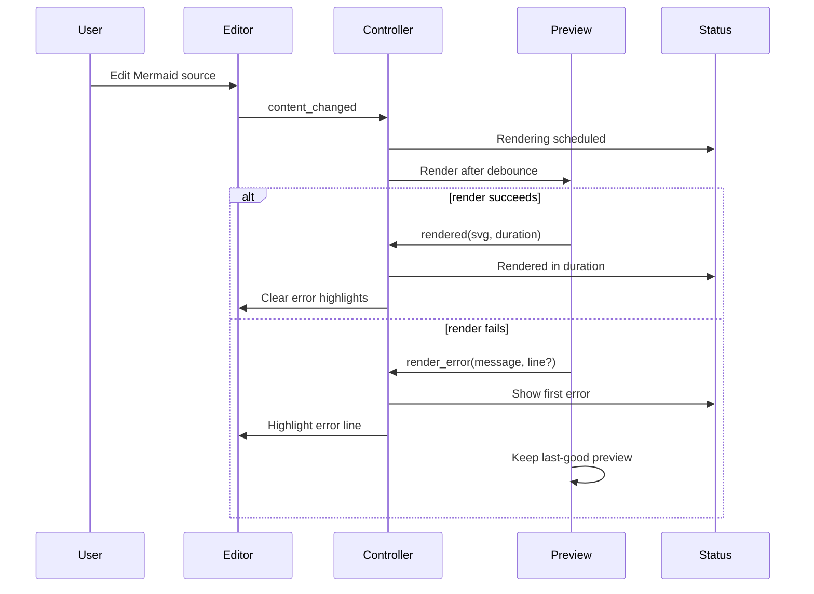

# Creative Phase: UI Layout and Feedback

## Status
Complete

## Type
UI/UX design

## Problem Statement
Atlantis needs a first-run MVP layout that feels understandable immediately: source on the left, preview on the right, persistent status feedback, and menus that make the app feel complete without expanding scope into full visual editing.

## Requirements
- Single main window.
- Left pane: Mermaid source editor.
- Right pane: live preview.
- Bottom status/feedback bar.
- Menu bar with enough coverage for confidence.
- Resizable split and persisted window/splitter state.
- Theme follows system theme.
- Error feedback must be visible without destroying the last good preview.
- Source-oriented visual navigation is future, not required for MVP.

## Options Analysis

### Option 1: Classic Two-Pane Split View with Status Bar
Description: `QMainWindow` with a central `QSplitter`: editor left, preview right, and a native status bar for render state/errors.

Pros:
- Directly matches the project brief.
- Familiar to engineers using editors and preview panes.
- Easy to persist via `QSplitter.saveState()` and `QSettings`.
- Low visual complexity.
- Works well with keyboard and mouse.

Cons:
- Error details can feel cramped if status bar is overloaded.
- No dedicated preview navigation panel.

Complexity: Low
Implementation time: Low
User fit: High

### Option 2: Three-Zone Layout with Bottom Error/Log Panel
Description: Editor/preview splitter plus a bottom dock or panel for errors/logs.

Pros:
- More space for render errors and logs.
- Better debugging during development.
- Can host future validation details.

Cons:
- Heavier first-run UI.
- Adds panel state management to MVP.
- Risks making the app feel like an IDE instead of focused Mermaid editor.

Complexity: Medium
Implementation time: Medium
User fit: Medium

### Option 3: Preview-First Layout with Collapsible Editor
Description: Larger preview area, collapsible editor, and context actions around the diagram.

Pros:
- Visually appealing for presentation-oriented users.
- Sets up future visual interactions.

Cons:
- Conflicts with code-first principle.
- Makes source editing less central.
- Adds avoidable layout complexity.

Complexity: Medium
Implementation time: Medium
User fit: Low for MVP

## Decision
Choose **Option 1: Classic Two-Pane Split View with Status Bar**, with a minimal optional log panel deferred until Phase 4.

## Rationale
The project is explicitly code-first and single-chart focused. A `QMainWindow` with `QSplitter` as the central widget matches PyQt6 idioms and keeps the first BUILD phase small. PyQt6 supports setting the central widget via `setCentralWidget()` and persisting splitter state through `QSettings`.

## Layout Guidelines
- Main window:
  - Central widget: horizontal `QSplitter`.
  - Left pane: `MermaidEditor`.
  - Right pane: `MermaidPreview`.
  - Status bar: render state, first error, file dirty status, autosave state.
- Initial splitter ratio:
  - 50/50 for first launch.
  - Restore saved state on later launches.
- Window state:
  - Persist geometry, maximized state, splitter state, wrap setting, debounce delay, autosave setting.
- Menu groups:
  - File: New, Open, Save, Save As, Recent, Close/Quit.
  - Edit: Undo, Redo, Cut, Copy, Paste, Select All, Toggle Wrap.
  - View: Reset Layout, Toggle Log Panel (disabled/deferred if not implemented), Reload Preview.
  - Diagram: Edit Front Matter, Validate, Render Now.
  - Help: Docs, About, Show Logs.
- Status bar behavior:
  - Idle: `Ready`
  - Dirty file: `Unsaved changes`
  - Rendering: `Rendering...`
  - Success: `Rendered in <ms> ms`
  - Error: `Error on line <n>: <message>`
  - Multiple errors: show first error with `1/<count>` and cycle action.

## Error Feedback Decision
Use layered feedback:
- Status bar is the primary concise error surface.
- Editor line highlight marks known error locations.
- Last-good preview remains visible on render failure.
- Dedicated error/log panel is optional and deferred to Phase 4.

Do not use blocking modal dialogs for parse/render errors.

## Interaction Flow

## Accessibility and Native Behavior
- Use native menus and standard shortcuts.
- Keep status text concise and readable.
- Provide keyboard shortcuts for common file and preview actions.
- Use system palette; avoid hard-coded dark/light color assumptions.
- Ensure reset layout action can recover from awkward splitter states.

## Validation
- Requirement coverage:
  - Single-window split layout: yes
  - Resizable panes: yes
  - Persisted state: yes
  - Status feedback: yes
  - Scope guardrails: yes
- Testing approach:
  - pytest-qt smoke test for window construction and splitter presence.
  - Settings roundtrip test for geometry/splitter bytes.
  - Error flow integration test with mocked renderer.
- Quality score: 46/50

## Next Steps
- Implement layout in `atlantis/ui/main_window.py`.
- Keep preview context menu minimal in MVP: Copy Mermaid Source and Reload Preview only.
- Defer visual element selection/source navigation until post-MVP.
